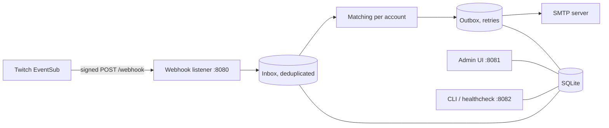

<p align="center">
  <picture>
    <source media="(prefers-color-scheme: dark)" srcset="docs/images/logo/logo-dark.svg">
    <source media="(prefers-color-scheme: light)" srcset="docs/images/logo/logo-light.svg">
    
  </picture>
</p>

<p align="center">
  <a href="https://github.com/replaymark/replaymark/actions/workflows/ci.yml"></a>
  <a href="https://github.com/replaymark/replaymark/releases/latest"></a>
  <a href="LICENSE"></a>
  <a href="https://github.com/replaymark/replaymark/pkgs/container/replaymark"></a>
</p>

replaymark is a self-hosted notifier for Twitch. It mails you when one of your favorite streamers goes live **and** plays a game you care about, either at stream start or when they switch to a matching category mid-stream. It listens to Twitch EventSub webhooks (`stream.online`, `stream.offline`, `channel.update`) and is managed through a small admin UI on your LAN. It also records which categories each stream covered and links straight into the VOD.

<picture>
  <source media="(prefers-color-scheme: light)" srcset="docs/images/overview-light.png">
  
</picture>

## Features

- Per streamer: specific games, a reusable game group, the default games, or any game.
- Exactly one mail per stream and game, also across restarts. Mails go through an outbox with retries.
- Timeline of every stream with all categories, filterable by game, with deep links into the VOD.
- Accounts with roles (admin, user). Each account has its own streamers, groups, recipients and mail language.
- First-run setup with a one-time code from the log. No password in the configuration.
- Admin UI and mails in English and German, light and dark mode, live updates via server-sent events.
- One container, SQLite in a volume, no other services. Distroless, rootless, read-only root filesystem.

## How it works



Only `POST /webhook` on port 8080 is public, behind your reverse proxy. The admin UI on 8081 is for LAN or VPN only. Port 8082 is bound to `127.0.0.1` inside the container. See [architecture](docs/architecture.md).

## Quick start

You need a host with Docker (or rootless Podman), a public HTTPS hostname for the webhook, an SMTP account and a Twitch application.

1. Create a Twitch application and a webhook secret: [docs/installation.md](docs/installation.md#1-create-the-twitch-application).
2. Get `compose.yaml` and `.env.example`, then fill in `.env`:

   ```sh
   curl -LO https://raw.githubusercontent.com/replaymark/replaymark/main/compose.yaml
   curl -L https://raw.githubusercontent.com/replaymark/replaymark/main/.env.example -o .env
   ```

   Before the first start also set `ADMIN_BIND` (default `127.0.0.1`) and, if you open the UI over plain `http://`, `ADMIN_COOKIE_SECURE=false` in `.env`. Otherwise the login fails silently.

3. Route `https://<your-domain>/webhook` to port 8080 with a reverse proxy ([nginx and Caddy examples](docs/installation.md#4-reverse-proxy-for-the-webhook)).
4. Start it and read the setup code:

   ```sh
   docker compose up -d
   docker logs replaymark 2>&1 | grep "Setup code"
   ```

5. Open `http://127.0.0.1:8081`, create the administrator with the code, then add streamers. Check with `docker exec replaymark node src/cli.ts status`.

Details, including building from source, are in [docs/installation.md](docs/installation.md).

## Documentation

| Document | Content |
|---|---|
| [Installation](docs/installation.md) | Twitch app, secrets, first start, reverse proxy, admin UI access, Podman, build from source |
| [Configuration](docs/configuration.md) | Every environment variable with default and meaning |
| [Usage](docs/usage.md) | Streamers, game groups, timeline, history, users, settings, accounts and roles |
| [Operations](docs/operations.md) | CLI, healthcheck, logs, backup, shutdown, local testing with the Twitch CLI |
| [Upgrading](docs/upgrading.md) | Migrations, backup, switching to the GHCR image, `ADMIN_PASSWORD_HASH` takeover, YAML import |
| [Troubleshooting](docs/troubleshooting.md) | Common problems and fixes |
| [Data and privacy](docs/privacy.md) | What is stored, telemetry, third-party requests of the browser |
| [Architecture](docs/architecture.md) | Design decisions and dependencies |
| [Development](docs/development.md) | Setup, commands, project structure |

## Contributing and security

Read [CONTRIBUTING.md](CONTRIBUTING.md) and the [Code of Conduct](CODE_OF_CONDUCT.md). Report vulnerabilities privately as described in [SECURITY.md](SECURITY.md). Changes are listed in the [changelog](CHANGELOG.md).

## Legal

replaymark is not affiliated with or endorsed by Twitch Interactive, Inc. Twitch is a trademark of Twitch Interactive, Inc. Bundled fonts are listed in [THIRD_PARTY_NOTICES.md](THIRD_PARTY_NOTICES.md).

## License

replaymark is free software under the [GNU Affero General Public License v3.0](LICENSE) (AGPL-3.0-only). If you run a modified version as a network service, you must offer its users the corresponding source code. Copyright (C) 2026 The replaymark contributors.
