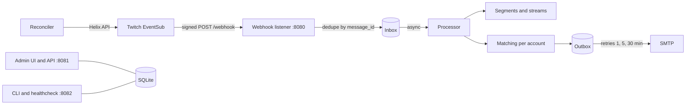

# Architecture

## Overview

One Node.js 24 process with three HTTP listeners (see [ports](installation.md#ports)), SQLite for storage and no other services.

- **Inbox and outbox:** every webhook message is stored deduplicated by `message_id` and processed asynchronously. Verification and revocation are stored only as a dedup entry. Mails are rendered when they are created and frozen in the outbox. On errors they are retried after 1, 5 and 30 minutes, then marked `failed` (resendable from the history). The test mail is sent directly, not through the outbox.
- **Sync (reconciler):** single flight with at most one follow-up run. Streamer changes trigger it after a 2 second debounce. The interval comes from the settings (1 to 168 hours).
- **Timeline:** segment boundaries use the receive time of the webhook message in the inbox (`receivedAt`) or `started_at` from `stream.online`, not the time of asynchronous processing, so an inbox backlog does not shift boundaries.

## Design decisions

Notable choices of the implementation.

- **Name:** project, container, service and image are called `replaymark` (formerly `twitch-notify`/`notify`). Commands therefore read `docker exec replaymark node src/cli.ts status`.
- **Multilingual:** the admin UI exists in English and German without an i18n library. `en.ts` is the source dictionary, `de.ts` is bound to it by type, so missing keys fail the typecheck. The language comes from `localStorage`, otherwise from the browser language.
- **Mail language:** a separate setting per account (`mailLanguage`, default `de`), independent of the UI language, because mails are generated without a browser context.
- **Hashed session IDs:** the database stores only the SHA-256 of the cookie value, so a DB leak reveals no valid sessions. Cookie `replaymark_session`, sliding expiry.
- **Password hash:** scrypt (`scrypt$N$r$p$salt$hash`) from `node:crypto`, no extra dependency.
- **In-memory login rate limit:** at most 5 failed attempts per IP in 15 minutes, reset on restart. Sufficient for a LAN.
- **No trust in `X-Forwarded-For`:** the IP for the rate limit comes from the TCP connection. Behind a reverse proxy all clients share the proxy IP. This is deliberate, a forged header could otherwise bypass the limit.
- **Origin check:** write API requests need an `Origin` whose host equals the `Host` header, otherwise `403`.
- **Lookup endpoint:** additionally `GET /api/streamers/lookup?login=...`, so the dialog can show avatar and display name before creating and report unknown logins right away.
- **Creating a streamer is two requests:** `POST /api/streamers` creates it, then the games are set with `PATCH /api/streamers/:id`.
- **Import with `{}`:** a streamer without its own games gets the "default games" mode. The `default_games` of the file are appended to the existing default games, not replaced.
- **Admin port binding:** `compose.yaml` binds to `127.0.0.1` by default and lets you choose the address through `ADMIN_BIND`, so a naive `docker compose up` never exposes the UI.
- **Admin UI always on:** the admin listener always starts. Without an account password it offers only the setup with the code from the log. `ADMIN_PASSWORD_HASH` is only the one-time takeover when upgrading.
- **Reset password over the internal port:** `reset-password` uses the unauthenticated listener on `127.0.0.1:8082`, like `import`. Whoever can reach it can reset any password.
- **Podman:** `podman build --format docker` is needed to keep the `HEALTHCHECK`.
- **Node 24 with native type stripping:** the server runs directly as `node src/index.ts` without a build step. Hence only erasable TypeScript syntax (no `enum`s, namespaces or parameter properties), relative imports with `.ts`, and shared code in `apps/server/src/shared/` instead of a workspace package (Node does not strip types under `node_modules`).
- **TypeScript 7:** `tsc --noEmit` with native TypeScript 7 for type checking only.
- **Own logger:** about 60 lines in `src/log.ts` instead of pino: JSON lines in production, readable lines in development, central redaction for keys such as `token`, `secret`, `password`, `hash`, `session`, `cookie`, `authorization` and for all known secret values from the environment.
- **Self-hosted fonts:** Big Shoulders Display (titles, streamer names) and Atkinson Hyperlegible Next (text) through `@fontsource-variable/*`, because the CSP allows only `'self'` and no requests should go to Google Fonts.
- **CSP:** `default-src 'self'`, images additionally from `https://static-cdn.jtvnw.net` (avatars, box art), `frame-ancestors 'none'`. Static assets are cached long, `index.html` is `no-cache`.
- **Mail time format:** `dd.MM.yyyy HH:mm` in both languages, time zone from `TZ`.
- **Timeline from official sources only:** Twitch has no official category history, so replaymark records categories itself from installation on, instead of scraping, unofficial GQL calls or third-party trackers. The history before installation is missing.
- **Event time instead of processing time:** see the timeline note above.
- **Approximate boundaries:** boundaries derived from a sync are stored as approximate (`startApprox`/`endApprox`), shown as "approx." in the UI, and deep links start 60 seconds earlier so the switch is not missed.
- **VOD resolver limits:** it runs every 10 minutes and after `stream.offline`, and after 7 days without a matching VOD it sets the state `none` and gives up. It does not re-check whether a found VOD was deleted. The UI only marks it as probably expired after 60 days.
- **Segment retention:** its own administrator setting `segmentRetentionDays` (default 365, `0` = forever), applied by the daily cleanup to whole ended streams, counted from the end of the stream.
- **Container:** distroless Node 24 runtime (no shell, no package manager), numeric user `1000:0` with a group-writable `/data` so it also runs with an arbitrary UID in group 0 and under rootless Podman, unprivileged ports only, a `HEALTHCHECK` without curl, read-only root filesystem.

## Legal

replaymark is not affiliated with or endorsed by Twitch Interactive, Inc. Twitch is a trademark of Twitch Interactive, Inc.

## Dependencies

| Package | Where | Reason |
|---|---|---|
| `yaml` | server (CLI) | Parse the legacy YAML file for `import`; Node has no YAML parser. |
| `@fontsource-variable/big-shoulders-display`, `@fontsource-variable/atkinson-hyperlegible-next` | web | Self-hosted fonts, CSP compliant, no external requests. |
| `class-variance-authority`, `clsx`, `tailwind-merge`, `tw-animate-css` | web | Runtime dependencies of the shadcn/ui components. |
| `@base-ui/react`, `sonner`, `lucide-react` | web | shadcn/ui base (Base UI variant), toasts and icons. |
| `@tailwindcss/vite`, `@vitejs/plugin-react`, `@tanstack/router-plugin` | web (dev) | Tailwind 4, React and file-based routing in the Vite build. |
| `hono` | web | `hc<AppType>` client for type-safe API calls. |
| `@types/*` | dev | Types for Node, React, better-sqlite3 and Nodemailer. |

Deliberately **not** used: pino (own logger), an i18n library, bcrypt/argon2 (scrypt from `node:crypto`), dotenv, `msw` (Twitch mocks through an injectable `fetch`).
