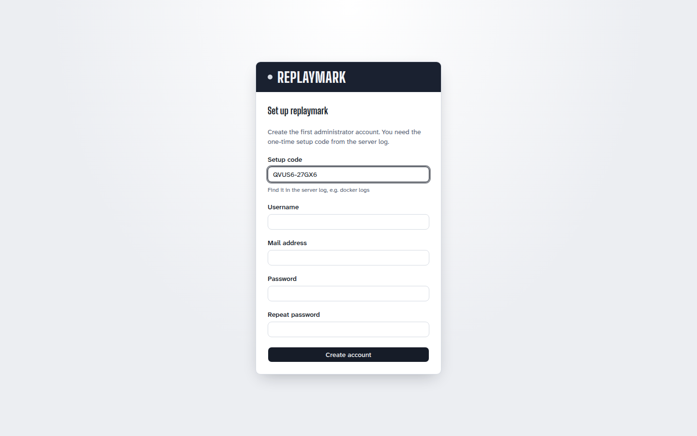

# Installation

replaymark runs as a single container. You need:

- Docker with Compose, or rootless Podman
- a public HTTPS hostname that reaches port 8080 through a reverse proxy (Twitch only delivers webhooks over HTTPS)
- an SMTP account
- a Twitch account with two-factor authentication enabled (required to register an application)

The container speaks plain HTTP only. TLS is your reverse proxy's job.

## Ports

One process, three listeners:

| Port | Binding in the container | Content | Reachability |
|---|---|---|---|
| `8080` | `0.0.0.0` | `POST /webhook` only, everything else `404` | public, through the reverse proxy |
| `8081` | `0.0.0.0` | admin UI (SPA), `/api/*`, SSE at `/api/events` | LAN or VPN only, **never public** |
| `8082` | `127.0.0.1` | `GET /healthz`, `/internal/*` for the CLI | inside the container only |

## 1. Create the Twitch application

Each operator registers their own Twitch application and is bound by the [Twitch Developer Services Agreement](https://legal.twitch.com/en/legal/developer-agreement/) for it.

1. Register a new application at <https://dev.twitch.tv/console/apps>.
2. Pick any name and category, and set the client type to **Confidential**.
3. Set the OAuth redirect URL to `http://localhost`. replaymark only uses app access tokens (client credentials).
4. Put the client ID and a freshly generated client secret into `.env` as `TWITCH_CLIENT_ID` and `TWITCH_CLIENT_SECRET`.

## 2. Create the webhook secret

```sh
openssl rand -hex 32
```

Put the value into `.env` as `TWITCH_WEBHOOK_SECRET` (10 to 100 characters, checked at startup). Twitch signs every message with HMAC-SHA256 using this secret. replaymark rejects messages with a wrong signature or a stale timestamp with `403`.

## 3. Configure and start

1. Download `compose.yaml` and the configuration template, or clone the repository:

   ```sh
   curl -LO https://raw.githubusercontent.com/replaymark/replaymark/main/compose.yaml
   curl -L https://raw.githubusercontent.com/replaymark/replaymark/main/.env.example -o .env
   ```

2. Fill in `.env`. All variables are listed in [configuration.md](configuration.md). Empty values (`FOO=`) count as unset. An invalid configuration stops the start with a message that names only the variables, never their values.

3. Start:

   ```sh
   docker compose up -d
   docker compose logs -f
   ```

   The log shows the callback URL, the number of streamers and the result of the first sync.

The image is `ghcr.io/replaymark/replaymark:<version>` (also `latest`) for `linux/amd64` and `linux/arm64`. Pin a release by setting `REPLAYMARK_VERSION` in `.env` or the shell.

### Container hardening

`compose.yaml` runs the distroless image as user `1000:0` with `read_only: true`, a tmpfs on `/tmp`, `cap_drop: [ALL]` and `no-new-privileges`. The only writable path is the `/data` volume. A `HEALTHCHECK` is built into the image. An optional memory limit (`mem_limit: 256m`) is prepared as a comment in the compose file. The image has no shell, so use `docker exec replaymark node ...` rather than `sh`.

### Build from source

```sh
docker compose -f compose.yaml -f compose.build.yaml up -d --build
```

### Podman

Rootless Podman works with the same compose file (`podman compose` or `podman-compose`). When you build the image yourself with Podman, use `podman build --format docker -t replaymark .`, otherwise the `HEALTHCHECK` is lost because the OCI image format does not know it.

## 4. Reverse proxy for the webhook

Twitch must reach `https://<your-domain>/webhook`. The proxy forwards **only this path** to port 8080. `TWITCH_CALLBACK_URL` must be exactly this public URL.

The request body must arrive **byte for byte unchanged**, because the HMAC signature is computed over the raw body. No re-encoding, no body rewriting, no filters or modules that touch the content. The Twitch headers (`Twitch-Eventsub-Message-*`) must be passed through, which nginx and Caddy do by default.

Do **not** include the admin UI (8081) in this public configuration.

### nginx

```nginx
server {
    listen 443 ssl;
    http2 on;
    server_name twitch.example.com;

    ssl_certificate     /etc/letsencrypt/live/twitch.example.com/fullchain.pem;
    ssl_certificate_key /etc/letsencrypt/live/twitch.example.com/privkey.pem;

    location = /webhook {
        limit_except POST { deny all; }
        proxy_pass http://127.0.0.1:8080/webhook;
        proxy_http_version 1.1;
        proxy_set_header Host $host;
        # Pass the body through unchanged: no sub_filter, no gzip rewrite or similar.
        client_max_body_size 1m;
    }

    location / {
        return 404;
    }
}
```

### Caddy

```caddyfile
twitch.example.com {
    handle /webhook {
        reverse_proxy 127.0.0.1:8080
    }
    handle {
        respond 404
    }
}
```

If the proxy runs in Docker on the same network, use the container name instead of `127.0.0.1:8080` (`replaymark:8080`).

## 5. First start: set up the administrator

Before the first start set `ADMIN_BIND` in `.env` (see [step 6](#6-admin-ui-access-in-the-lan-or-vpn)). If you open the UI over plain `http://`, also set `ADMIN_COOKIE_SECURE=false`, otherwise the login fails silently.

There is no password in `.env`. On the first start without any account password the service writes a one-time setup code to the log (level `warn`, a JSON line in production):

```sh
docker logs replaymark 2>&1 | grep "Setup code"
# {"time":"2026-10-03T10:00:00.000Z","level":"warn","msg":"No account exists yet. Open the admin UI and finish setup with this code, valid until the service restarts: Setup code: XXXXX-XXXXX"}
```

Open the admin UI (port 8081). It shows the **Setup** page: enter the setup code, a username, an email address and a password.



The code is valid until the next restart and is regenerated on every start as long as no account has a password. After setup, the setup page stays locked for good, also across restarts.

Upgrading from a version with a single admin password: see [upgrading.md](upgrading.md#admin_password_hash-takeover).

Then log in and go to **Settings** to set your mail recipients and mail language. As an administrator you also set the sync interval and the timeline retention there. Maintain the default games on the **Games** page and add streamers on the **Overview** page. See [usage.md](usage.md).

Verify the installation:

```sh
docker exec replaymark node src/cli.ts status
docker exec replaymark node src/cli.ts test-mail
```

`status` and `test-mail` act on the first administrator: `status` lists their streamers with live state and subscription state. After a short time all subscriptions should be `enabled`. `docker compose exec replaymark ...` works as well.

## 6. Admin UI access in the LAN or VPN

The admin UI is meant for a LAN or VPN (for example Tailscale) only. It uses server-sent events at `/api/events`, so a proxy in front of it must neither buffer this response nor close it after a short time (the server sends a ping every 20 seconds).

### Binding port 8081

`compose.yaml` publishes the admin port on `ADMIN_BIND` (default `127.0.0.1`). Set it in `.env` or the shell:

| Variant | `ADMIN_BIND` | Access |
|---|---|---|
| Local only, or through a proxy on the same host | `127.0.0.1` (default) | `http://127.0.0.1:8081` or through the reverse proxy |
| LAN address of the host | for example `192.168.1.10` | `http://192.168.1.10:8081` from the LAN |
| Tailscale address | for example `100.64.0.5` | `http://100.64.0.5:8081` from the tailnet |

Never use a public interface or `0.0.0.0` on a host with a public IP.

The session cookie is `Secure` by default. If you open the UI over plain `http://` in the LAN, set `ADMIN_COOKIE_SECURE=false`, otherwise the login fails silently.

### nginx (LAN only)

```nginx
server {
    listen 192.168.1.10:443 ssl;
    http2 on;
    server_name replaymark.lan;

    ssl_certificate     /etc/nginx/certs/replaymark.lan.crt;
    ssl_certificate_key /etc/nginx/certs/replaymark.lan.key;

    allow 192.168.1.0/24;
    allow 100.64.0.0/10;   # Tailscale
    deny all;

    location / {
        proxy_pass http://127.0.0.1:8081;
        proxy_http_version 1.1;
        proxy_set_header Host $host;
    }

    location = /api/events {
        proxy_pass http://127.0.0.1:8081;
        proxy_http_version 1.1;
        proxy_set_header Host $host;
        proxy_set_header Connection '';
        proxy_buffering off;
        proxy_cache off;
        proxy_read_timeout 1h;
    }
}
```

The `Host` header must be preserved: for write requests the API compares the `Origin` header with the `Host` header and rejects a mismatch with `403`.

### Caddy (LAN only)

```caddyfile
replaymark.lan {
    tls internal
    @outside not remote_ip 192.168.1.0/24 100.64.0.0/10
    respond @outside 403

    reverse_proxy 127.0.0.1:8081 {
        flush_interval -1
    }
}
```

`flush_interval -1` disables buffering so SSE events arrive immediately.

## Uninstalling

Removing a streamer in the UI deletes its Twitch subscriptions right away (through a sync). Before you decommission the service, remove all streamers and run `docker exec replaymark node src/cli.ts sync`, otherwise the subscriptions stay on Twitch. Then `docker compose down -v` removes the container and the volume with the database. Without `-v` the volume is kept.
