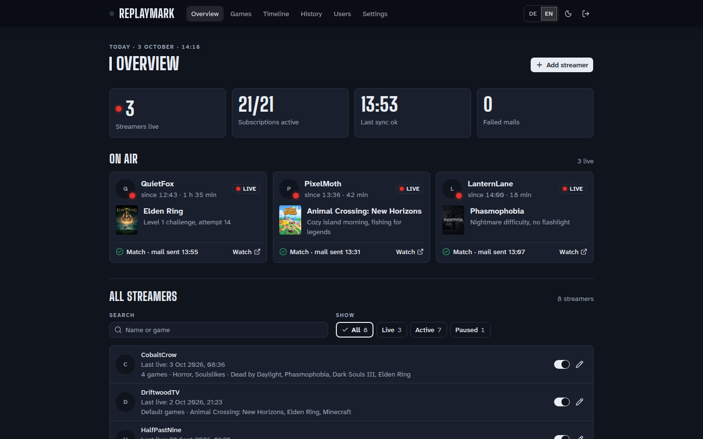
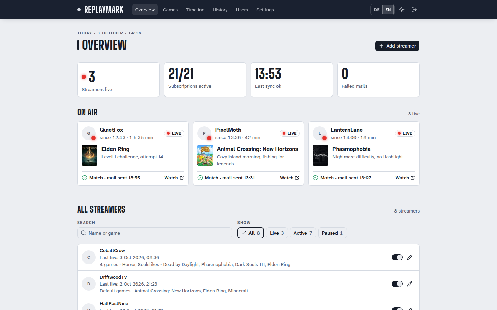
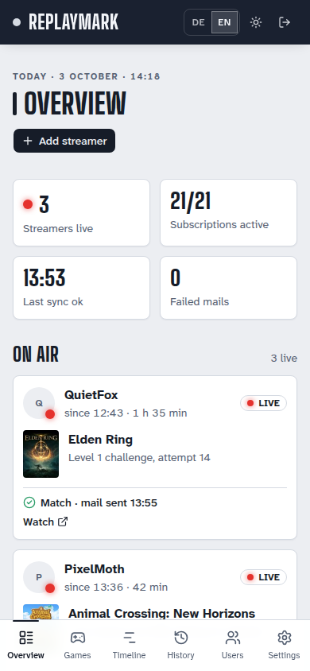
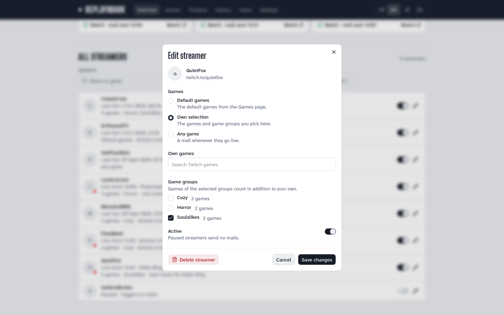
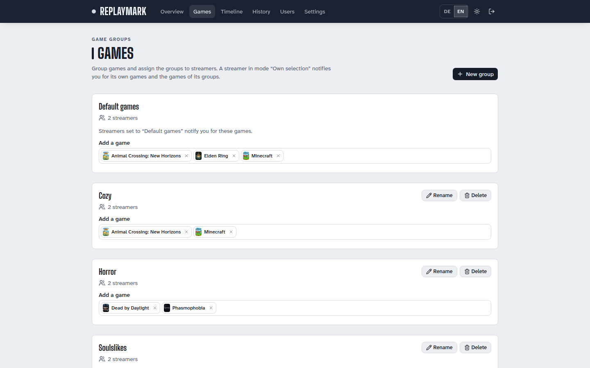
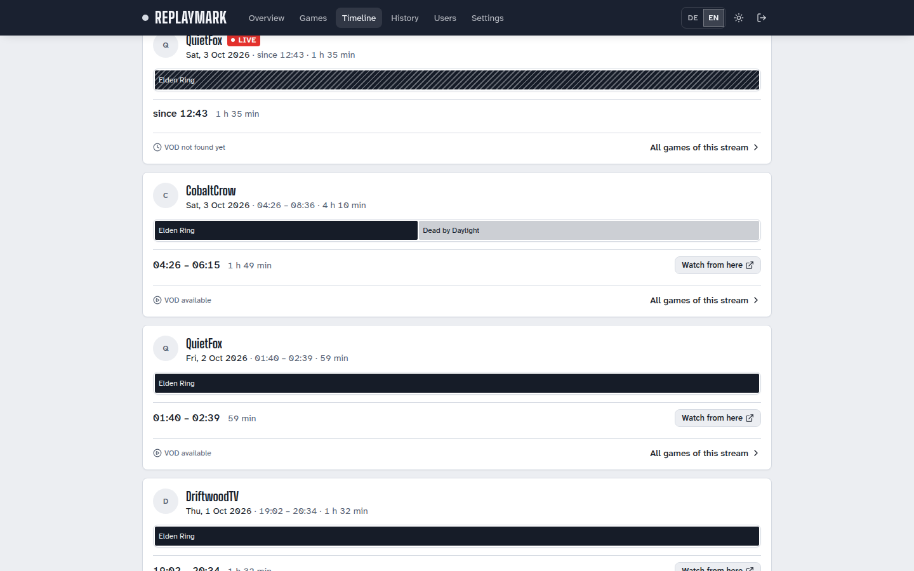
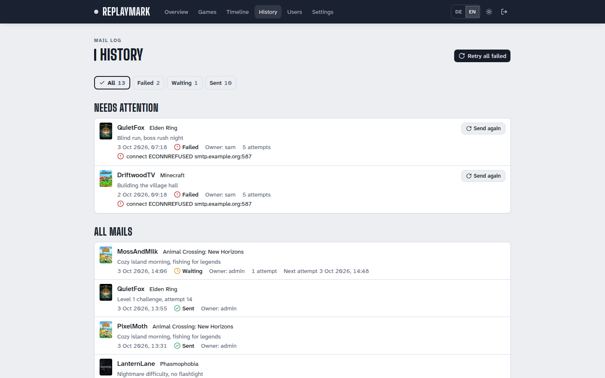
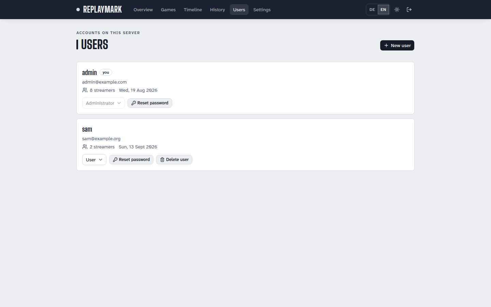
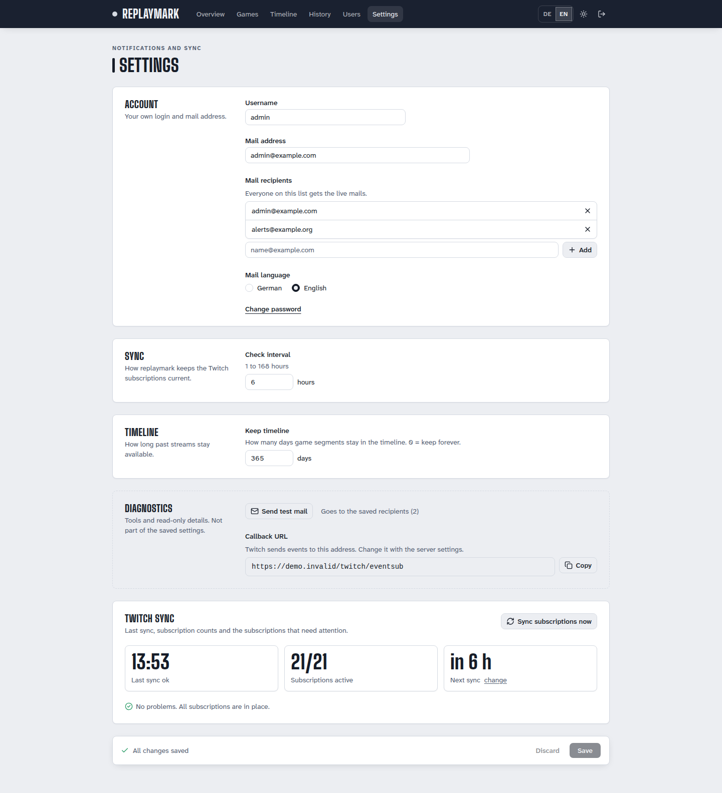

# Usage

The admin UI is served on port 8081 (see [installation](installation.md#6-admin-ui-access-in-the-lan-or-vpn)). It is available in English and German: switch the language in the UI. The choice is stored in the browser, with the browser language as fallback. Light and dark mode are available, and pages update live through server-sent events.

The admin UI works on phones too:

## Streamers

Add streamers on the **Overview** page. The dialog looks up the login first and shows avatar and display name, or reports an unknown login immediately. Per streamer you choose which games trigger a mail:

- **Specific games**: a selection of games.
- **Game group**: a reusable group of games.
- **Default games**: the account's default games (see [Games and game groups](#games-and-game-groups)).
- **Any game**: every game.

Removing a streamer removes its Twitch subscriptions at the next sync, which runs about 2 seconds after the change.

Exactly one mail is sent per stream and game, also across restarts. After `stream.online`, replaymark fetches category and title from the Helix API and mails only if the game matches. A category change during a stream (`channel.update`) can trigger a mail as well.

## Games and game groups

The **Games** page manages the default games and your game groups. Groups can be reused by several streamers.

## Timeline

The timeline shows which categories the watched streamers played in their streams, filterable by game, with a segment per category and direct links into the VOD.

- **What is recorded:** every stream of every watched streamer with **all** categories, not only the subscribed games. A segment begins at `stream.online` or a category change (`channel.update`) and ends at the next change or at `stream.offline`.
- **Since when:** only from the moment you run a version with the timeline. Twitch offers no official API for the category or chapter history of past streams, so older streams cannot be added.
- **Approximate boundaries:** boundaries that did not come from a webhook but were detected during a sync (for example after a missed event) are imprecise and marked "approx.". Deep links to such boundaries jump 60 seconds earlier into the VOD.
- **VOD requirements:** VOD links exist only if the channel has "Store past broadcasts" enabled. The VOD resolver runs every 10 minutes (and right after `stream.offline`) but checks the same stream at most once per hour. The archive is refreshed during the stream and after it ends. If none is found after 7 days, the stream counts as "no VOD".
- **VOD expiry:** Twitch deletes VODs after 7, 14 or 60 days depending on the account type. The UI marks VODs of streams older than 60 days as probably expired. It does not re-check whether a VOD still exists.
- **Retention:** ended streams and their segments are removed by the daily cleanup once their end is older than `segmentRetentionDays` days (default 365, `0` keeps everything). Only administrators can change it, under Settings.
- **Official sources only:** no scraping, no unofficial GQL API, no third-party trackers: only EventSub and the official Helix API.

## History

The history lists every mail with its state. Failed mails can be sent again from there. Mails are rendered once when they are created and retried after 1, 5 and 30 minutes on errors, then marked `failed`.

## Users, accounts and roles

- There are two roles: **administrator** and **user**. The first administrator is the account created during setup.
- Administrators create further accounts under **Users**. The temporary password is shown once, and the user must change it at the first login.
- Each account has its own streamers, game groups, recipients, mail language and notifications. Several accounts can follow the same streamer, and each receives its own mail.
- Subscription sync, the sync interval, the timeline retention and user management are reserved for administrators. The test mail is available to everyone and goes to the recipients of the account that sends it.
- Forgot your password? Run `docker exec replaymark node src/cli.ts reset-password <username>`. It prints a new temporary password once, ends all sessions of the account and requires a change at the next login. An unknown account ends the command with an error code.

## Settings

Under **Settings** every account sets its mail recipients and mail language. Administrators additionally set the sync interval (1 to 168 hours) and the timeline retention. The default games are maintained on the **Games** page, not under Settings. The mail language is a separate setting (default `de`) and independent of the UI language, because mails are generated without a browser context. Timestamps in mails use `dd.MM.yyyy HH:mm` in both languages, in the time zone from `TZ`.

